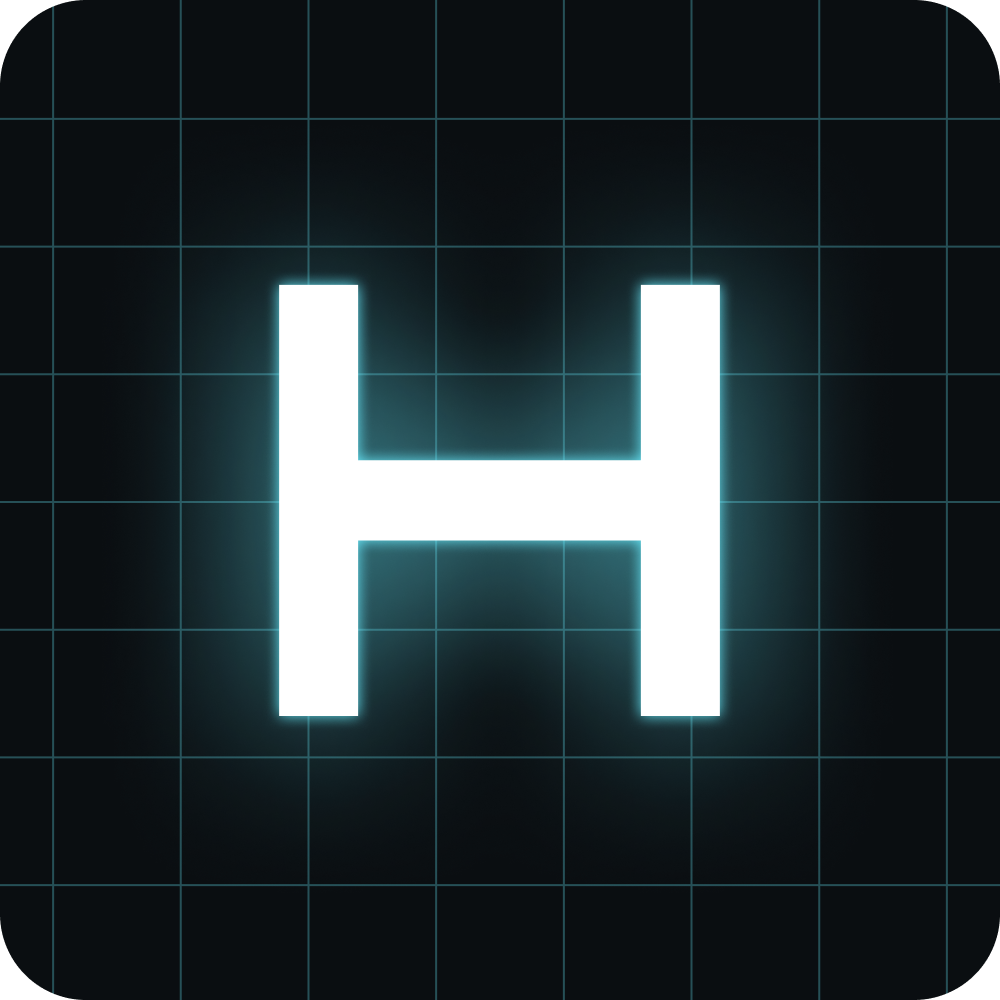

<div align="center">
  
  
   
</div>

# Hyperdrive Portfolio

A stunning portfolio website with a hyperspace travel animation built with Vue 3 and featuring smooth GSAP transitions.

## Features

- **Hyperspace Animation**: Interactive star field animation with warp speed effect
- **Advanced Visual Effects**: Multiple cinematic transition systems:
  - **Holographic Sweep**: Full-screen scanning beam for theme changes
  - **Text Flicker**: Matrix-style text distortion for language switches
  - **Energy Cascades**: Expanding energy rings for theme transitions
  - **Lightsaber Sparks**: Interactive cursor trail effects with particle systems
- **Command Panel UI**: Retro-futuristic bottom navigation with holographic effects
- **Crystal Kyber Color Themes**: Choose from 5 different Star Wars kyber crystal colors (Blue, Green, Purple, Red, Yellow)
- **Multi-language Support**: Full i18n support with Spanish, English, Portuguese, and Shavian
- **Auto Language Detection**: Automatically detects browser language on first visit
- **Theme & Language Persistence**: Your preferences are saved in localStorage
- **Custom Scrollbar**: Themed scrollbar that matches your selected kyber crystal color
- **Modern UI**: Star Wars-inspired design with dynamic neon aesthetics
- **Smooth Transitions**: GSAP-powered animations for seamless UX
- **Responsive Design**: Fully responsive layout with Tailwind CSS
- **Vue 3 Composition API**: Built with modern Vue 3 script setup syntax
- **Hologram Modals**: Interactive project detail modals with sci-fi effects
- **Interactive Canvas**: Dynamic star field with mouse-responsive particle effects

## Tech Stack

- **Vue 3** - Progressive JavaScript framework
- **Vite** - Next generation frontend tooling
- **Vue I18n** - Internationalization plugin for Vue 3
- **Tailwind CSS** - Utility-first CSS framework
- **GSAP** - Professional-grade animation library
- **HTML5 Canvas** - For hyperspace star animation

## Installation

```bash
# Install dependencies
yarn install

# Run development server
yarn dev

# Build for production
yarn build

# Preview production build
yarn preview
```

## Usage

1. **Enter Hyperspace**: Press and hold mouse button or touch screen to activate warp speed
2. **View Portfolio**: Release to jump to the portfolio section
3. **Use Command Panel**: Access the bottom navigation to:
   - **Select Language**: Click the flag button to switch between Spanish, English, Portuguese, or Shavian (triggers text flicker effect!)
   - **Choose Kyber Crystal**: Click the palette button to select your preferred crystal kyber color theme (triggers holographic sweep!)
   - **Return to Space**: Click the return button (appears when in portfolio view)
4. **Interactive Effects**: 
   - Move your mouse to create lightsaber cursor trails
   - Click anywhere to generate impact spark effects
   - Hover over interactive elements for scan line effects
5. **Project Details**: Click on any project to open holographic modal with detailed information

### 🌌 Advanced Visual Effects System

Experience multiple cinematic effects that create an immersive sci-fi experience:

#### **Theme Change Effects**
- **Holographic Sweep** (1 second): Full-screen translucent scanning beam sweeps left to right with animated scanlines and bright center beam
- **Energy Cascades**: Expanding energy rings that radiate outward from interaction points
- **Hyper-Dimensional Reconstruction**: Advanced particle effects with dimensional shift animations

#### **Language Change Effects**  
- **Text Flicker** (600ms): All text elements flicker with brightness variations and holographic glow
- **Staggered Animation**: 10ms cascade across elements for smooth visual feedback

#### **Interactive Effects**
- **Lightsaber Cursor Trails**: Dynamic particle sparks that follow mouse movement
- **Impact Sparks**: Radiating particle bursts on click interactions
- **Hologram Scan Lines**: Animated scan line effects on interactive elements

#### **Modal & UI Effects**
- **Hologram Modals**: Project detail modals with sci-fi holographic styling
- **Command Panel Pulses**: Breathing glow effects on navigation elements
- **Dynamic Theme Synchronization**: All effects automatically match your selected kyber crystal color

This comprehensive effects system creates a cohesive Star Wars-inspired experience while maintaining smooth performance!

### Available Languages

- **Español** - Spanish (default)
- **English** - English
- **Português** - Portuguese
- **Shavian** - Star Wars Galactic Basic Standard alphabet

### Available Crystals Kyber Themes

- 🔵 **Ilum** (Blue) - The classic Jedi kyber
- 🟢 **Adegan** (Green) - The wise Jedi's choice
- 🟣 **Hurrikaine** (Purple) - The unique kyber of a legendary Jedi Master
- 🔴 **Synthetic** (Red) - The dark side's crimson kyber
- 🟡 **Golgen** (Yellow) - The golden kyber of the Jedi Temple Guards

## Customization

### Update Personal Information

Edit the portfolio components in `src/components/portfolio/`:

- `PortfolioHeader.vue` - Name, title, and avatar
- `AboutSection.vue` - About me description
- `TimelineSection.vue` - Work experience timeline
- `ProjectsSection.vue` - Featured projects
- `TestimonialsSection.vue` - Client testimonials
- `ContactSection.vue` - Contact information
- `PortfolioFooter.vue` - Footer with copyright information

### Advanced Effects Customization

The project includes several specialized composables for visual effects:

- `src/composables/useTheme.js` - Theme management and color definitions
- `src/composables/useThemeEffects.js` - Advanced theme transition effects
- `src/composables/useLightsaberEffects.js` - Interactive cursor and particle effects
- `src/composables/useCommandPanelEffects.js` - Command panel animation effects
- `src/composables/useProjectModal.js` - Modal and hologram effects

### Update GitHub Link

Edit `src/components/GithubCorner.vue` and replace:
```
https://github.com/juanlias/hyperdrive-portfolio
```

### Add New Languages

Add a new language file in `src/i18n/locales/` (e.g., `fr.json`) following the existing structure, then update:

1. Import in `src/i18n/index.js`:
```javascript
import fr from './locales/fr.json'
```

2. Add to messages object:
```javascript
messages: {
  es, en, pt, fr
}
```

3. Add flag and name in `src/components/LanguageSelector.vue`:
```javascript
const languages = [
  // ... existing
  { code: 'fr', flag: '🇫🇷', name: 'Français' }
]
```

### Add New Theme Colors

Edit `src/composables/useTheme.js` to add new crystal kyber color themes:

```javascript
export const themes = {
  // Add your custom theme here
  custom: {
    id: 'custom',
    name: 'Custom Name',
    description: 'Custom kyber',
    color: '#yourcolor',
    warpColor: 'rgba(r, g, b, 1)'
  }
}
```

Then update CSS variables in `src/style.css`:

```css
:root[data-theme="custom"] {
  --primary-color: #yourcolor;
  /* ... other color variables */
}
```

## 📄 License

MIT License - feel free to use this for your own portfolio!

## 🤝 Contributing

Contributions, issues, and feature requests are welcome!

---

**Created with ❤️ by [Juan Lias](https://github.com/juanlias)** and the power of **hyperspace** travel ⚡
